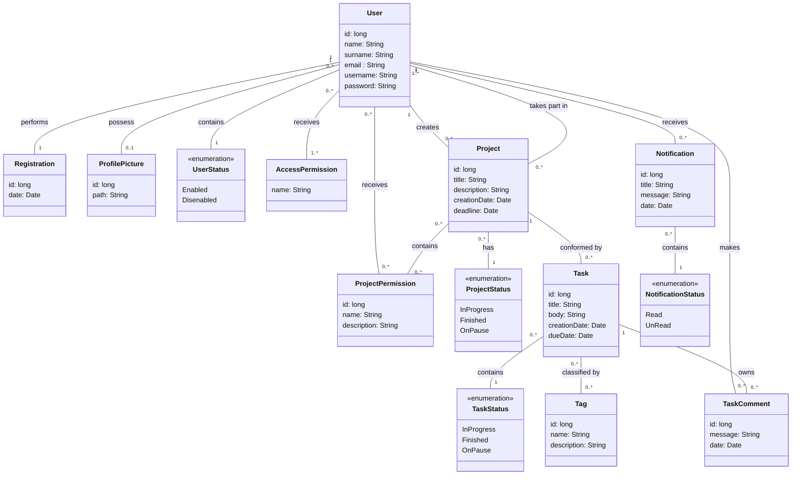

# Sistema Task Planner

## Contenidos
- [Acerca del proyecto](#acerca-del-proyecto)
- [Metodología de trabajo](#metodología-de-trabajo) 
- [Tecnologías y herramientas](#tecnologías-y-herramientas)
    - [Planificación y diagramación](#planificación-y-diagramación)
    - [Desarrollo](#desarrollo)
    - [Testing](#testing)
    - [Despliegue](#despliegue)
- [Diseño del sistema](#diseño-del-sistema)
    - [Modelo conceptual](#modelo-conceptual)
    - [Diagrama entidad-relacion](#diagrama-entidad-relación)
    - [Diagrama de clases](#diagrama-de-clases)

## Acerca del proyecto
Este proyecto presenta el desarrollo de una *REST API* para un sistema de gestión de tareas llamado **Task Planner**, con el que se pueda trabajar y dar seguimiento a distintas labores de manera eficiente y colaborativa.

En principio, se espera poder:

- [ ] Registrar y autenticar usuarios en el sistema.
- [ ] Administrar perfil de usuarios.
- [ ] Crear y administrar tareas y proyectos.
- [ ] Agregar colaboradores y definir sus permisos.
- [ ] Discutir tareas con distintos colaboradores.
- [ ] Recibir notificaciones sobre los proyectos y tareas.

> [!IMPORTANT]
> El sistema aún está en desarrollo, por lo que estos objetivos podrían cambiar.

## Metodología de trabajo

El desarrollo de la aplicación se realiza bajo **metodología ágil**, haciendo posible entregar y poner en producción el desarrollo en distintos *sprints*, priorizando aquellas funcionalidades que se consideran de **valor** e **indispensables** en el sistema.

Siguiendo la misma, las unidades de trabajo obtenidas del **relevamiento de requerimientos** son definidas y desglosadas en *Epics*, *Features*, *User Stories* y *Tasks*.

Así mismo, el **diseño** realizado antes de cada sprint se hace entorno a un modelo conceptual en el que se incluyen sus conceptos relevantes, sus relaciones y atributos más básicos. Luego, se hace la **actualización de los diagramas** de entidad-relación y clases (en caso de ser necesario).

## Tecnologías y herramientas

### Planificación y diagramación
- Azure DevOps (Azure Boards): para definición y desglose de trabajo obtenidos del relevamiento de requerimientos, y planificación de sprints.
- Trello: para creación y organización de tareas de planificación del proyecto.
- Mermaid: herramienta basada en JavaScript para creación de diagramas UML.
- Diagrams.net: herramienta para creación de diagramas UML.

### Desarrollo
- Spring Boot: framework para el desarrollo de la REST API.
- Spring Security: para autenticaciones y autorizaciones de los usuarios a las funcionalidades del sistema.
- Spring Data JPA: para integración de tecnología ORM e interacción con la base de datos.
- MySql: motor de base de datos para el almacenamiento de datos del sistema.

### Testing
- JUnit: librería para testing unitario.
- Mockito: librería para testear componentes del sistema aislándolos de sus dependencias.
- Postman: software para testear los endpoints del sistema.

### Despliegue

> [!IMPORTANT]
> Aún no se definen las herramientas de despliegue.

> [!NOTE]
> Para el **control de versiones** del código y el **enlace** de los distintos commits a las tareas desglosadas se usa este repositorio de GitHub y no uno de Azure DevOps pues, en caso contrario, todo aquel que quiera visualizar el repositorio deberá tener una cuenta de dicho servicio.

## Diseño del sistema
A continuación, se presenta el diseño actual del sistema:

### Modelo conceptual
En este modelo se realiza una asociación de los distintos conceptos identificados a partir de los objetivos que debe cumplir el sistema.

### Diagrama entidad-relación
En este diagrama se demuestra el modelo que actualmente tiene la base de datos.

Algunos datos a tener encuenta:
- Los *email* y *username* no pueden repetirse en el sistema (son *UNIQUE*)
- Se podría tener una entidad *user_status* para almacenar el valor de habilitación del usuario pero, en caso de querer obtenerlo, se requeriría una consulta extra.

### Diagrama de clases
En este diagrama se presentan las distintas clases que tiene el modelo actual del sistema.

> [!NOTE]
> Entre los métodos de algunas clases se tendrá *getters()* y *setters()* para indicar que se deben implementar **TODOS** los métodos getters y setters correspondientes a dichas clases. Se prefiere indicar de esta manera por cuestiones de tamaño y legibilidad del diagrama.

Algunos datos a tener en cuenta:
- DTOs: se usan para evitar el envío de información no necesaria y/o confidencial entre las capas del sistema.
- RestResponseEntityExceptionHandler: actúa como administrador global de las excepciones que puedan arrojar los controladores.
- JwtFilter: implementa JWT para usar tokens en las requests.
- SecurityConfig: configuración de autenticaciones y autorizaciones de la aplicación.

> [!NOTE]
> En caso de errores u omisiones, los diagramas podrían ser actualizados incluso durante el desarrollo.
